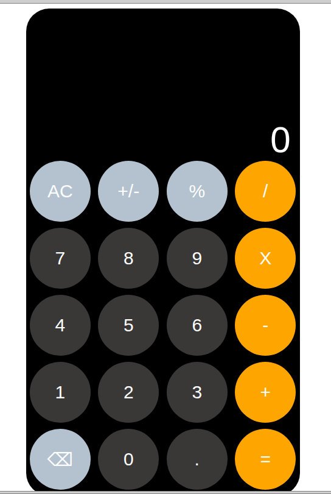

# 🧮 ODP--Calculator



A calculator application built with JavaScript focusing on **logic handling and UI synchronization**.

---

## 📌 Features

* ➕ Basic arithmetic operations
* 🔁 Continuous calculations
* ⚠️ Handles edge cases (division by zero)
* 📺 Live display updates

---

## 🛠️ Technologies

* HTML
* CSS
* JavaScript

---

## 🚀 Getting Started

```bash
git clone https://github.com/AvielZaman/ODP--Calculator.git
cd ODP--Calculator
open index.html
```

---

## 🧠 What I Practiced

* Event handling
* Managing calculation state
* Building logic without eval()

---

## 🔮 Future Improvements

* Keyboard support
* Scientific functions
* History feature
